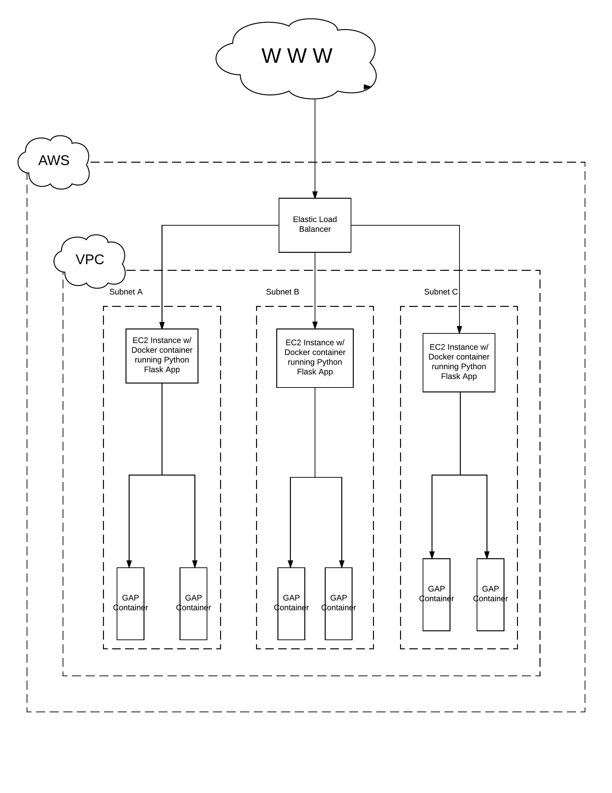

# GAP Microservices Architecture

* AWS Components
	* AWS Elastic Load Balancer
	* AWS Virtual Private Cloud
	* AWS Subnettting
	* AWS Autoscaling group and configuration
	* AWS Amazon Machine Image configured with Docker
* Application Components
	* AWS AMI configured with Docker
	* Python Flask Web Server configured by
	* GAP Docker container

# Description
This application leverages load balancing and auto scaling for scalability. Multiple subnets
are utilized to assure geographic isolation for fault tolerance and high availability. The Elastic Cloud Compute (EC2) instances will be part of an auto-scaling group which will scale if the instance's CPU utilization rate surpasses 70%.

An Amazon Machine Image (AMI) will be installed on each EC2 instance. A Python Flask web server will be running in a container on each instance. When a query is made to the ELB it is sent to the Python Flask Web Server. Logic implemented in Python creates a Docker container for each request made to the web server. Once the job is done processing output is returned to the user and the container is destroyed.
